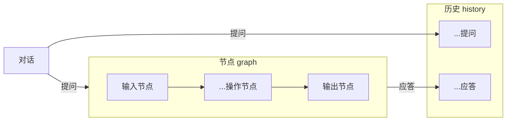

# baklavajs-vue-chatbot

## An example of baklavajs vue + ts

```mermaid
graph LR;
  对话 -- 提问 --> 提问;
  对话 -- 提问 --> 节点;
  节点 -- 应答 --> 应答;
  subgraph 节点[节点 graph]
    direction LR
    输入节点 --> ...操作节点 --> 输出节点
  end
  subgraph 历史[历史 history]
    direction LR
    提问[...提问]
    应答[...应答]
  end
```
