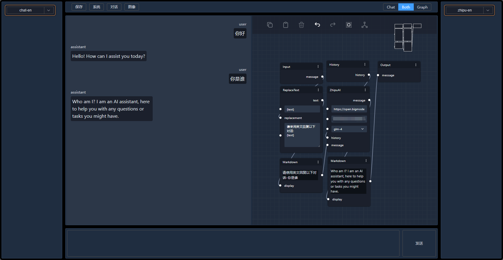
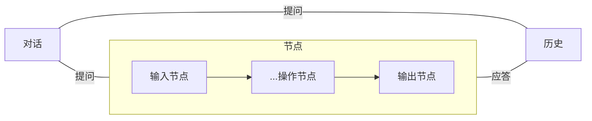

# baklavajs-vue-chatbot

## An example of baklavajs vue + ts

```mermaid
graph LR;
  对话--提问---历史;
  对话--提问---节点;
  节点--应答---历史;
  subgraph 节点
    direction LR
    输入节点--> ...操作节点  -->输出节点
  end
```
